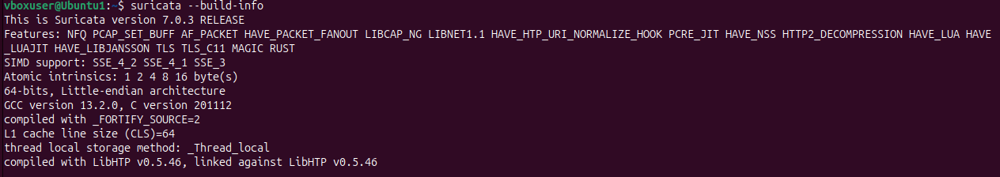
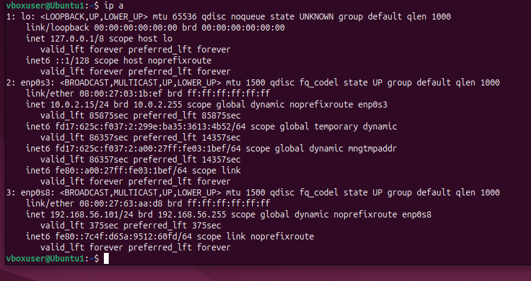
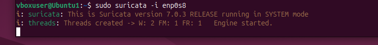
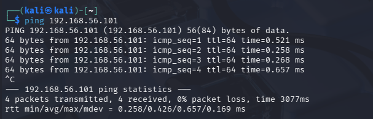
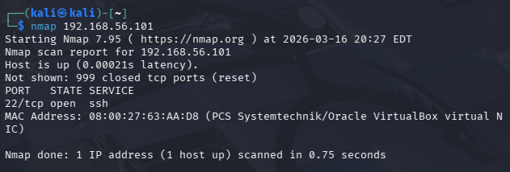
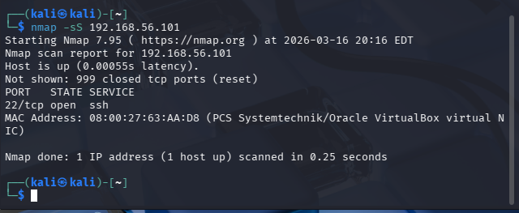
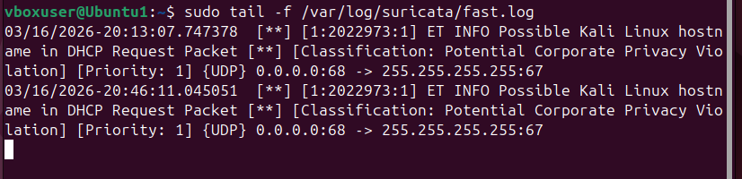
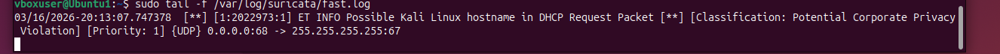

# Network IDS Lab – Suricata Detection Project

Author: Shamain Greaves

## Project Overview
This project demonstrates a network intrusion detection lab built using Suricata, Ubuntu, Kali Linux, and VirtualBox.

The lab simulates attacker activity from a Kali Linux system and demonstrates how an Intrusion Detection System (IDS) can detect suspicious network traffic and generate alerts.

This project showcases practical SOC analyst skills including network monitoring, IDS deployment, attack simulation, and alert investigation.

---

## Lab Architecture

Kali Linux (Attacker)  
↓  
Ubuntu Server (Suricata IDS Sensor)  
↓  
Suricata IDS Engine  
↓  
Alert Logs  

---

## Lab Environment

| Component | Technology |
|-----------|------------|
| Virtualization | VirtualBox |
| Attacker Machine | Kali Linux |
| IDS Sensor | Ubuntu Server |
| IDS Platform | Suricata |
| Network Configuration | NAT + Host-Only Adapter |

---

## Suricata Installation

Suricata was installed on the Ubuntu server and verified using:

```
suricata --build-info
```

### Suricata Installation Verification


---

## Suricata Log Directory

After installation, Suricata creates a directory to store IDS logs and alerts.

### Suricata Log Directory


---

## Network Interface Identification

The monitored interface was identified using:

```
ip a
```

The host-only interface `enp0s8` was used to monitor traffic between the attacker and the Ubuntu system.

### Network Interface


---

## Running Suricata

Suricata was started to monitor network traffic using:

```
sudo suricata -i enp0s8
```

### Suricata Engine Running


---

## Attack Simulation

Network activity was generated from the Kali Linux attacker machine.

### Connectivity Test

```
ping 192.168.56.101
```



---

### Basic Network Scan

```
nmap 192.168.56.101
```



---

### SYN Scan

```
nmap -sS 192.168.56.101
```



---

## Alert Monitoring

Suricata alerts were monitored using:

```
sudo tail -f /var/log/suricata/fast.log
```

### Suricata Alert Detection


---

### Suricata Alert Log Monitoring


---

## Incident Summary

During the attack simulation, Suricata detected suspicious network activity originating from the Kali Linux attacker machine.

Alerts generated by the Emerging Threats rule set indicated the presence of a Kali Linux host on the network. These alerts confirmed that Suricata successfully inspected network traffic and detected potentially suspicious behavior.

---

## Skills Demonstrated

- Network intrusion detection  
- Security monitoring  
- Network traffic analysis  
- IDS deployment  
- Threat detection investigation  
- Cybersecurity lab deployment  

---

## Future Improvements

- Integrate Suricata alerts into a SIEM platform  
- Create custom IDS detection rules  
- Simulate additional attack techniques  
- Deploy Suricata in IPS mode
- Build alert dashboards

---

## Detection Rule

Suricata uses signature-based detection rules to identify suspicious or malicious network activity.  
During the attack simulation, Suricata triggered alerts based on rules from the **Emerging Threats Open rule set**.

These rules analyze network traffic patterns and generate alerts when known indicators or behaviors are detected.

### Example Detection Rule Logic

One of the alerts generated during the scan identified traffic originating from a Kali Linux host.

Example rule logic:

```
alert tcp any any -> any any (msg:"ET SCAN Suspicious inbound to MSSQL port 1433"; sid:2000001; rev:1;)
```

### Detection Purpose

The rule-based detection helps identify:

- Network scanning activity
- Suspicious traffic patterns
- Potential attacker reconnaissance
- Unauthorized access attempts

### Investigation Outcome

When the Nmap scans were executed from the Kali Linux machine, Suricata analyzed the packets and triggered alerts indicating potentially suspicious activity on the network.

The alerts were written to the Suricata log file:

```
/var/log/suricata/fast.log
```

These alerts confirmed that the IDS was successfully inspecting network traffic and detecting reconnaissance activity generated during the attack simulation.

This demonstrates how IDS platforms such as Suricata can help security teams detect early stages of an attack, including reconnaissance and network probing.
